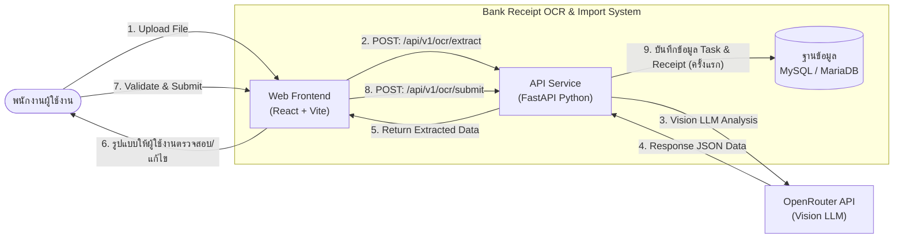
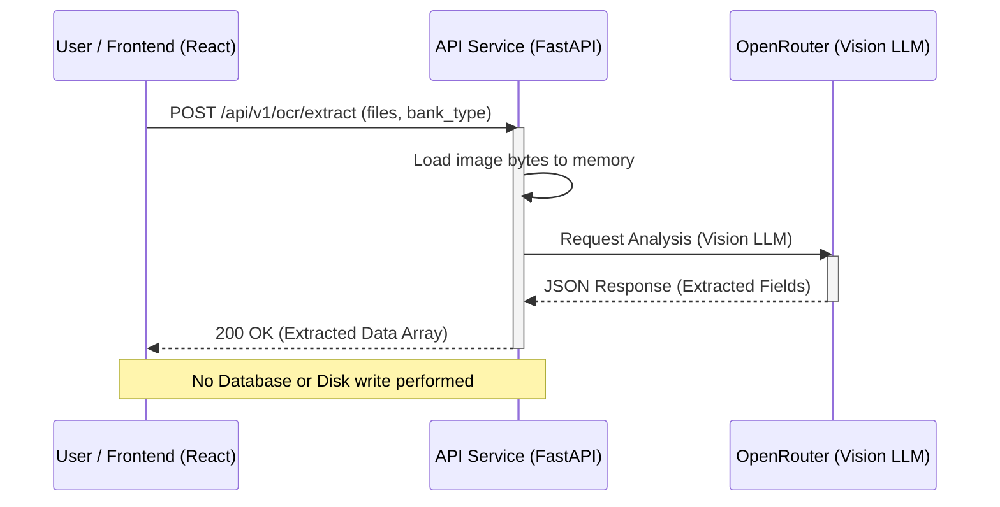
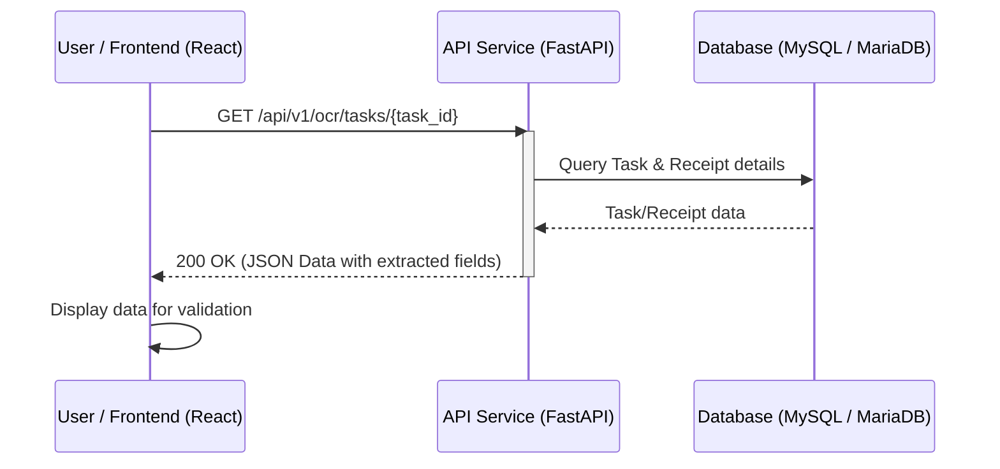
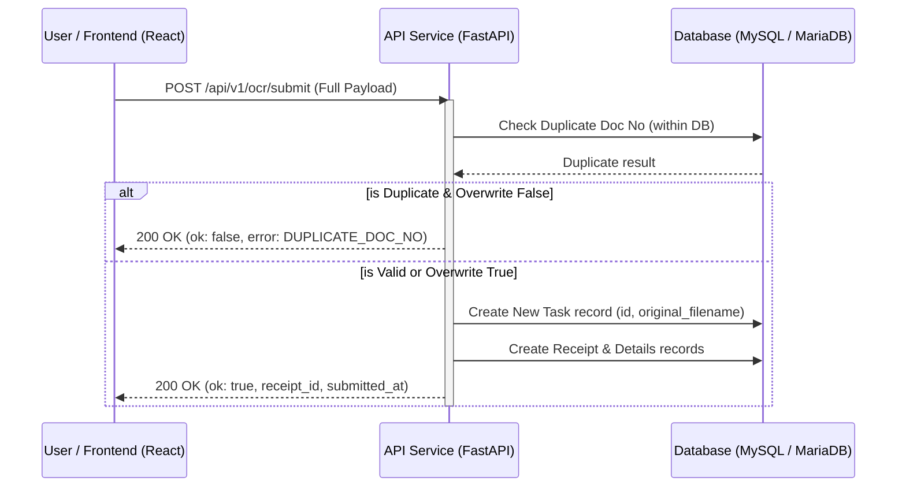

# 3. แผนภาพการทำงาน (System Interface Diagrams)

## 3.1 High-Level Architecture

แผนภาพแสดงภาพรวมการทำงานและการเชื่อมต่อระหว่างส่วนต่างๆ ภายในระบบ (Bank Receipt OCR & Import System) และระบบภายนอก เรียงตามลำดับขั้นตอนการทำงาน:

### คำอธิบายเชื่อมโยงการทำงานระหว่างระบบ (Flow Details)

1. **User (พนักงานผู้ใช้งาน)** เลือกไฟล์และระบบสร้าง Local Preview (Blob URL) ทันที
2. **Web Frontend** ส่งไฟล์ไปที่ **API Service (FastAPI)**
3. **API Service** ส่งข้อมูลรูปภาพไปให้ **OpenRouter (Vision LLM)** วิเคราะห์โดยตรง (Stateless)
4. **OpenRouter** ส่งผลลัพธ์เป็น Structured Data กลับมาที่แบคเอนด์
5. **API Service** ส่งต่อข้อมูล JSON ให้ **Web Frontend** **(ยังไม่มีการบันทึกลงฐานข้อมูลในขั้นตอนนี้)**
6. **User** ตรวจสอบและแก้ไขข้อมูลบนหน้าจอ
7. **User** กดยืนยันการนำเข้าข้อมูล (Submit)
8. **Web Frontend** ส่งข้อมูลชุดสมบูรณ์ (Final Data) ไปที่ **API Service**
9. **API Service** ทำการบันทึกลงใน **Database (MySQL / MariaDB)** และเก็บชื่อไฟล์ดั้งเดิมไว้เป็นหลักฐาน

---

## 3.2 Sequence Diagram: API 1 - Extract OCR Data (Upload)

ขั้นตอนการส่งไฟล์รูปภาพหรือ PDF เพื่อให้ระบบใช้ Vision LLM ในการอ่านและสกัดข้อมูล

## 3.3 Sequence Diagram: API 2 - Get OCR Result (Polling/Fetch)

การดึงข้อมูลที่สกัดได้จากฐานข้อมูลเพื่อนำมาแสดงผลบนหน้าจอให้ผู้ใช้งานตรวจสอบ

## 3.4 Sequence Diagram: API 3 - Submit Validated Data (Final Save)

ขั้นตอนการบันทึกข้อมูลลงฐานข้อมูลโดยเสร็จสมบูรณ์เมื่อผ่านการตรวจสอบแล้ว

---
