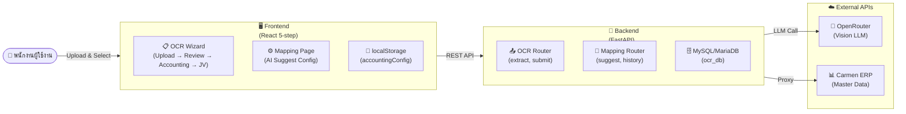
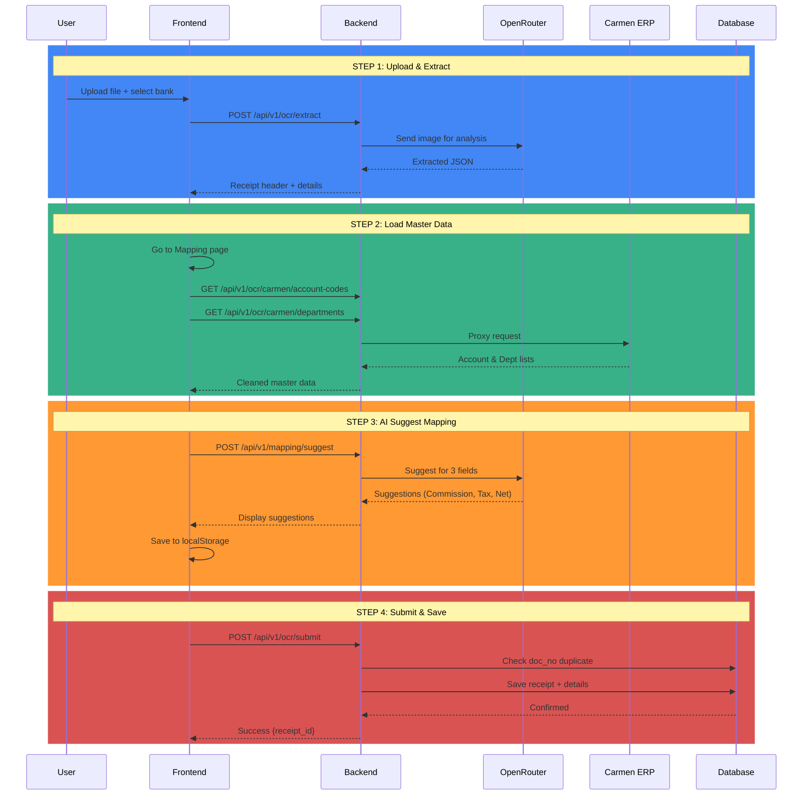
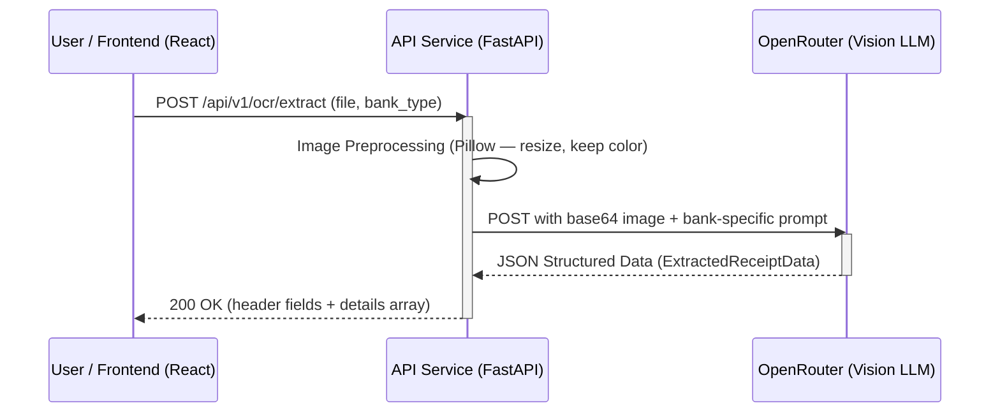
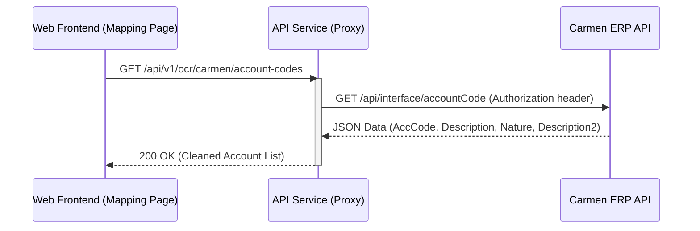
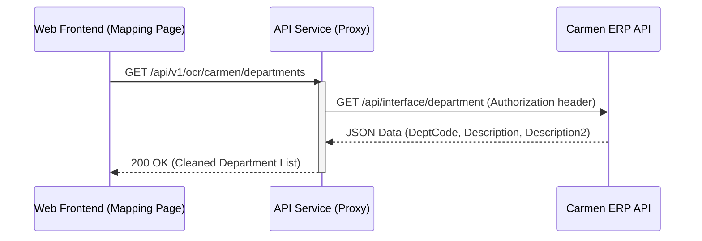
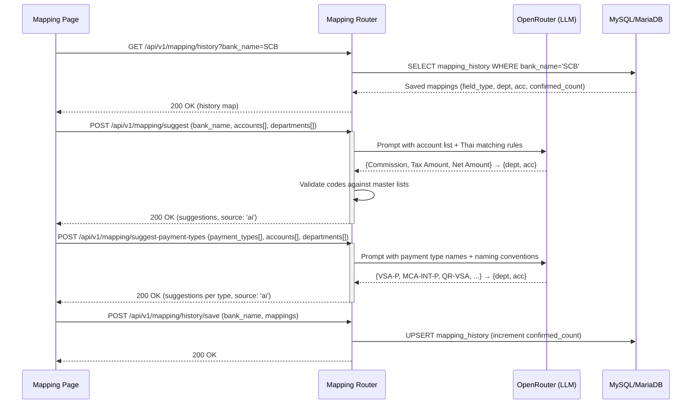
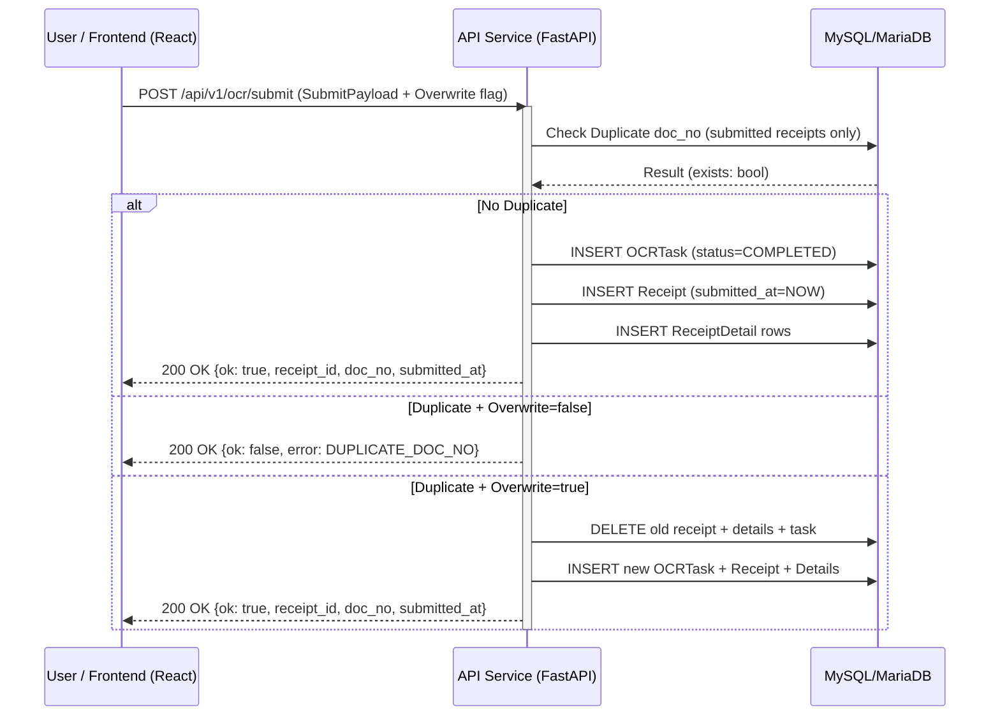

# Requirement Specification: Bank Receipt OCR & Import System Integration

**Project:** Bank Receipt OCR & Import System (API Integration)  
**Date:** 8 April 2026  
**Author:** Intern Team

---

## 0. ประวัติการแก้ไขเอกสาร (Version History)

| Version | Date | Author | Description |
| :--- | :--- | :--- | :--- |
| 1.0 | 01 Apr 2026 | Intern Team | Initial Draft (OCR Integration & LLM Analysis) |
| 1.1 | 01 Apr 2026 | Intern Team | Stateless Refactor & React Frontend Parity Migration |
| 1.2 | 02 Apr 2026 | Intern Team | Carmen API Proxy Integration (Account & Department Master Data) |
| 1.3 | 02 Apr 2026 | Intern Team | Separated Sequence Diagrams by individual API endpoints |
| 1.4 | 02 Apr 2026 | Intern Team | Final Polish: Detailed API Specs, JSON Samples, and Non-Functional Requirements |
| 1.5 | 08 Apr 2026 | Intern Team | Major update: AI Mapping Suggestion, 5-step wizard, Mapping Router, JournalVoucher, updated DB schema & env vars |

---

## 1. บทนำ (Introduction)

เอกสารฉบับนี้จัดทำขึ้นเพื่อกำหนดขอบเขตและความต้องการในการเชื่อมต่อระบบ (Interface Requirements) ระหว่างระบบ **Bank Receipt OCR System** และ **Carmen ERP** ผ่านรูปแบบ RESTful API (JSON Format) โดยมีวัตถุประสงค์เพื่อลดขั้นตอนการทำงานซ้ำซ้อน (Double Entry) และเพิ่มความแม่นยำในการนำเข้าข้อมูลบัญชีรายวันจากรายงานของธนาคาร

## 2. ขอบเขตงาน (Scope of Work)

การเชื่อมต่อข้อมูลประกอบด้วย 5 ส่วนหลัก เรียงตามลำดับความสำคัญดังนี้:

1. **Outbound Interface - OCR Extraction**: ประมวลผลไฟล์ภาพหรือ PDF ผ่าน Vision LLM เพื่อดึงข้อมูลออกมาเป็นรูปแบบ JSON (Stateless Extraction)
2. **Inbound Interface - Master Data Sync**: แบคเอนด์ทำหน้าที่เป็น Proxy ดึงข้อมูลรหัสบัญชีและแผนกจาก Carmen ERP เพื่อใช้ในการตั้งค่า Mapping
3. **Inbound Interface - AI Accounting Mapping**: ระบบ AI แนะนำรหัสบัญชีอัตโนมัติ พร้อมการบันทึกประวัติการแมปแยกตามธนาคารและประเภทการชำระเงิน
4. **Inbound Interface - Accounting Journal Review**: กระบวนการแสดง Journal Entry (Debit/Credit) และยืนยัน Journal Voucher ก่อน Submit
5. **Inbound Interface - Data Submission**: ส่งข้อมูลชุดสมบูรณ์ที่ผ่านการตรวจสอบแล้วบันทึกลงในฐานข้อมูล SQLite พร้อมการตรวจสอบการซ้ำซ้อน

---

## 3. แผนภาพการทำงาน (System Interface Diagrams)

### 3.1 System Components

ระบบประกอบด้วย **3 ส่วนหลัก**:



### 3.2 Request Flow (ลำดับขั้นตอนข้อมูล)

แผนภาพแสดงการไหลของข้อมูล **step-by-step** ตามลำดับ:



### 3.3 Sequence Diagram: API 1 - Extract OCR Data (Stateless)

ขั้นตอนการส่งไฟล์เพื่อใช้ Vision LLM ในการอ่านข้อมูล (ไม่บันทึกลงฐานข้อมูล)



### 3.4 Sequence Diagram: API 2 - Get Account Codes (Proxy)

การดึงข้อมูลผังบัญชีจาก Carmen ผ่านแบคเอนด์ Proxy



### 3.5 Sequence Diagram: API 3 - Get Departments (Proxy)

การดึงข้อมูลแผนกจาก Carmen ผ่านแบคเอนด์ Proxy



### 3.6 Sequence Diagram: API 4 - AI Mapping Suggestion

ขั้นตอนการให้ AI แนะนำรหัสบัญชีสำหรับ field แต่ละประเภท



### 3.7 Sequence Diagram: API 5 - Submit Validated Data

ขั้นตอนการบันทึกข้อมูลที่ผ่านการตรวจสอบแล้ว พร้อมตรวจสอบการซ้ำซ้อน



---

## 4. ขั้นตอนการปฏิบัติงานของผู้ใช้งาน (User Operational Workflow)

### 4.1 กระบวนการนำเข้าข้อมูลรายวัน (5-Step OCR Wizard)

1. **Step 1 — Upload**: เจ้าหน้าที่เลือกธนาคาร (BBL/KBANK/SCB) และอัปโหลดไฟล์ภาพหรือ PDF
2. **Step 2 — Processing**: ระบบส่งไฟล์ให้ Vision LLM ประมวลผลและแสดงสถานะการอ่าน
3. **Step 3 — Verification**: เจ้าหน้าที่ตรวจสอบและแก้ไขข้อมูล Header (ชื่อเอกสาร, วันที่, เลขที่เอกสาร ฯลฯ) และรายการย่อย (Details)
4. **Step 4 — Accounting Review**: ระบบโหลด Account Mapping จาก localStorage และแสดง Journal Entry (Debit/Credit) พร้อมแจ้งเตือนหาก mapping ไม่ครบ
5. **Step 5 — Journal Voucher**: แสดง JV สรุปรายการบัญชีทั้งหมด เจ้าหน้าที่ยืนยันก่อนบันทึกลงระบบ

### 4.2 กระบวนการตั้งค่า Account Mapping

1. เจ้าหน้าที่เข้าหน้า **Mapping** แล้วเลือกธนาคาร
2. ระบบ auto-fetch Carmen Account Codes + Departments และโหลดประวัติการแมปจาก DB
3. ระบบ auto-trigger AI Suggest เพื่อแนะนำรหัสบัญชีสำหรับ:
   - 3 fields หลัก: **Commission, Tax Amount, Net Amount**
   - ประเภทการชำระเงินทุกประเภทที่มีในสลิป (Visa, Mastercard, QR codes, ฯลฯ)
4. เจ้าหน้าที่ยืนยันหรือปรับแก้ mapping แต่ละรายการ
5. ระบบบันทึก mapping ลง DB (MappingHistory) และ localStorage

---

## 5. รายละเอียดและสเปกของ API (API Specifications)

### 5.1 API 1: Extract OCR Data (Stateless)

**วัตถุประสงค์**: ประมวลผลรูปภาพด้วย Vision LLM และส่งข้อมูลกลับทันที ไม่บันทึกลงฐานข้อมูล

**Method**: POST | **Endpoint**: `/api/v1/ocr/extract`

| Parameter | Type | Required | Description |
| :--- | :--- | :--- | :--- |
| `file` | Binary (multipart) | Yes | ไฟล์ภาพหรือ PDF (max 20MB) |
| `bank_type` | String (query) | Yes | รหัสธนาคาร: `BBL`, `KBANK`, `SCB` |

**JSON Response**:
```json
{
  "bank_name": "SCB",
  "bank_companyname": "ธนาคารไทยพาณิชย์ จำกัด (มหาชน)",
  "bank_tax_id": "0107536000791",
  "bank_address": "9 ถนนรัชดาภิเษก แขวงลาดยาว",
  "branch_no": "0001",
  "doc_name": "รายงานสรุปยอดขาย",
  "doc_no": "SCB-2026-00123",
  "doc_date": "08/04/2026",
  "company_name": "บริษัท ตัวอย่าง จำกัด",
  "company_tax_id": "0105555000001",
  "merchant_name": "EXAMPLE CO LTD",
  "merchant_id": "123456789",
  "wht_rate": "1",
  "wht_amount": "100.00",
  "net_amount": "9900.00",
  "details": [
    { "transaction": "VISA", "pay_amt": "5000.00", "commis_amt": "75.00", "tax_amt": "5.25", "total": "4919.75" },
    { "transaction": "MASTERCARD", "pay_amt": "5000.00", "commis_amt": "75.00", "tax_amt": "5.25", "total": "4919.75" }
  ]
}
```

---

### 5.2 API 2: Get Account Codes from Carmen

**วัตถุประสงค์**: ดึงข้อมูลผังบัญชี (Chart of Accounts) สำหรับแสดงใน dropdown ของหน้า Mapping

**Method**: GET | **Endpoint**: `/api/v1/ocr/carmen/account-codes`

**JSON Response**:
```json
{
  "status": "success",
  "Data": [
    { "AccCode": "113200", "Description": "BANK RECEIVABLE", "Description2": "ลูกหนี้ธนาคาร", "Nature": "DEBIT" },
    { "AccCode": "214100", "Description": "VAT PAYABLE", "Description2": "ภาษีมูลค่าเพิ่มค้างจ่าย", "Nature": "CREDIT" }
  ]
}
```

---

### 5.3 API 3: Get Departments from Carmen

**วัตถุประสงค์**: ดึงข้อมูลรายชื่อแผนก สำหรับแสดงใน dropdown ของหน้า Mapping

**Method**: GET | **Endpoint**: `/api/v1/ocr/carmen/departments`

**JSON Response**:
```json
{
  "status": "success",
  "Data": [
    { "DeptCode": "100", "Description": "ACCOUNTING", "Description2": "แผนกบัญชี" },
    { "DeptCode": "200", "Description": "FINANCE", "Description2": "แผนกการเงิน" }
  ]
}
```

---

### 5.4 API 4a: AI Suggest Mapping (3 Fixed Fields)

**วัตถุประสงค์**: ให้ AI แนะนำรหัสบัญชีสำหรับ Commission, Tax Amount, Net Amount โดยอ้างอิงรายการบัญชีจาก Carmen

**Method**: POST | **Endpoint**: `/api/v1/mapping/suggest`

**JSON Request**:
```json
{
  "bank_name": "SCB",
  "accounts": [{ "AccCode": "113200", "Description": "BANK RECEIVABLE", "Nature": "DEBIT" }],
  "departments": [{ "DeptCode": "100", "Description": "ACCOUNTING" }]
}
```

**JSON Response**:
```json
{
  "suggestions": {
    "Commission": { "dept": "100", "acc": "551100" },
    "Tax Amount": { "dept": "100", "acc": "214100" },
    "Net Amount": { "dept": "100", "acc": "113200" }
  },
  "source": "ai"
}
```

---

### 5.5 API 4b: AI Suggest Payment Type Mapping

**วัตถุประสงค์**: ให้ AI แนะนำรหัสบัญชีสำหรับแต่ละประเภทการชำระเงิน (Visa, Mastercard, QR, ฯลฯ)

**Method**: POST | **Endpoint**: `/api/v1/mapping/suggest-payment-types`

**JSON Request**:
```json
{
  "bank_name": "SCB",
  "payment_types": ["VSA-DCC-P", "MCA-INT-P", "QR-VSA", "QR-MCA"],
  "accounts": [...],
  "departments": [...]
}
```

**JSON Response**:
```json
{
  "suggestions": {
    "VSA-DCC-P": { "dept": "100", "acc": "113201" },
    "MCA-INT-P": { "dept": "100", "acc": "113202" },
    "QR-VSA":    { "dept": "100", "acc": "113203" },
    "QR-MCA":    { "dept": "100", "acc": "113203" }
  },
  "source": "ai"
}
```

---

### 5.6 API 4c: Load / Save Mapping History

**Load**: GET `/api/v1/mapping/history?bank_name=SCB`

```json
{
  "bank_name": "SCB",
  "history": {
    "Commission":  { "dept": "100", "acc": "551100", "confirmed_count": 5 },
    "Tax Amount":  { "dept": "100", "acc": "214100", "confirmed_count": 5 },
    "Net Amount":  { "dept": "100", "acc": "113200", "confirmed_count": 5 }
  }
}
```

**Save**: POST `/api/v1/mapping/history/save`

```json
{
  "bank_name": "SCB",
  "mappings": {
    "Commission": { "dept": "100", "acc": "551100" },
    "Net Amount":  { "dept": "100", "acc": "113200" }
  }
}
```

---

### 5.7 API 5: Submit Final Data

**วัตถุประสงค์**: บันทึกข้อมูลที่ผ่านการตรวจสอบแล้วลงฐานข้อมูล (OCRTask + Receipt + ReceiptDetails)

**Method**: POST | **Endpoint**: `/api/v1/ocr/submit`

**JSON Request**:
```json
{
  "BankType": "SCB",
  "Header": {
    "DocNo": "SCB-2026-00123",
    "DocDate": "08/04/2026",
    "BankName": "SCB",
    "DocName": "รายงานสรุปยอดขาย",
    "CompanyName": "บริษัท ตัวอย่าง จำกัด",
    "CompanyTaxId": "0105555000001",
    "MerchantName": "EXAMPLE CO LTD",
    "MerchantId": "123456789",
    "WhtRate": "1",
    "WhtAmount": "100.00",
    "NetAmount": "9900.00"
  },
  "Details": [
    { "Transaction": "VISA", "PayAmt": 5000, "CommisAmt": 75, "TaxAmt": 5.25, "Total": 4919.75 }
  ],
  "Overwrite": false
}
```

**JSON Response (success)**:
```json
{
  "ok": true,
  "receipt_id": 42,
  "doc_no": "SCB-2026-00123",
  "submitted_at": "2026-04-08T10:30:00Z"
}
```

**JSON Response (duplicate)**:
```json
{
  "ok": false,
  "error": "DUPLICATE_DOC_NO",
  "message": "เลขที่เอกสาร SCB-2026-00123 มีอยู่แล้วในระบบ"
}
```

---

## 6. โครงสร้างฐานข้อมูล (Database Schema)

ระบบใช้ **MySQL/MariaDB** ผ่าน `aiomysql` (async) โดยมี 4 ตาราง:

| ตาราง | คำอธิบาย | คอลัมน์หลัก |
| :--- | :--- | :--- |
| `ocr_tasks` | Metadata ของการประมวลผลแต่ละไฟล์ | id, original_filename, status (pending/processing/completed/failed), created_at |
| `receipts` | ข้อมูล Header ของเอกสาร (1 รายการต่อ task) | bank_name, bank_type, doc_no, doc_date, company_name, company_tax_id, merchant_name, merchant_id, wht_rate, wht_amount, net_amount, bank_companyname, bank_tax_id, bank_address, branch_no, submitted_at |
| `receipt_details` | รายการย่อยของการชำระเงิน (หลายรายการต่อ receipt) | transaction, pay_amt, commis_amt, tax_amt, wht_amount, total |
| `mapping_history` | ประวัติการแมปรหัสบัญชีแยกตามธนาคาร | bank_name, field_type, dept_code, acc_code, confirmed_count |

---

## 7. ข้อกำหนดอื่นๆ (Non-Functional Requirements)

1. **Authentication**: การเชื่อมต่อ Carmen API ต้องผ่าน `Authorization` header ของแบคเอนด์เท่านั้น ห้าม frontend เรียกตรง
2. **Duplicate Prevention**: ระบบต้องตรวจสอบ `doc_no` ซ้ำก่อน submit ทุกครั้ง โดยเปรียบเทียบเฉพาะ receipt ที่มี `submitted_at IS NOT NULL`
3. **Overwrite Capability**: เมื่อ `Overwrite=true` ระบบต้องลบ record เดิมทั้งหมดก่อนสร้างใหม่ (hard delete)
4. **Data Mapping Cache**: ระบบเก็บ mapping config ใน localStorage (`accountingConfig`, `accountMappingAmount`) เพื่อให้ใช้ซ้ำได้โดยไม่ต้อง re-fetch ทุกครั้ง
5. **Error Reporting**: กรณีเกิดข้อผิดพลาด (422) แบคเอนด์ต้องส่งรายละเอียดสาเหตุเพื่อแสดงผลใน `CustomModal`
6. **Performance**: API Master Data (Carmen Proxy) ต้องตอบสนองไม่เกิน 3 วินาที; AI Suggest ไม่เกิน 10 วินาที
7. **Safe Migration**: `migrate_db()` ต้องทำงาน idempotent — ไม่เกิด error เมื่อ column มีอยู่แล้ว
8. **Color Image Processing**: ห้ามแปลงภาพเป็น grayscale ก่อนส่ง Vision LLM เพราะลดความแม่นยำในการอ่าน
9. **File Size Limit**: ไฟล์ต้องมีขนาดไม่เกิน 20 MB ต่อไฟล์; รองรับ JPG, PNG, BMP, WebP, GIF, PDF
