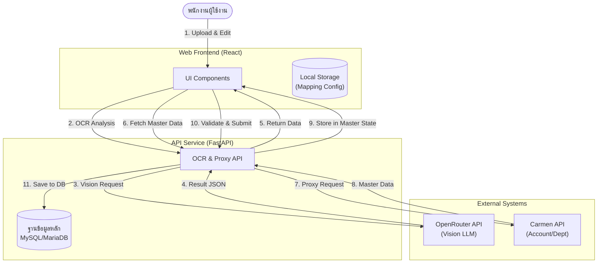
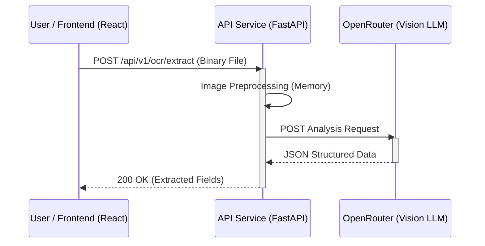
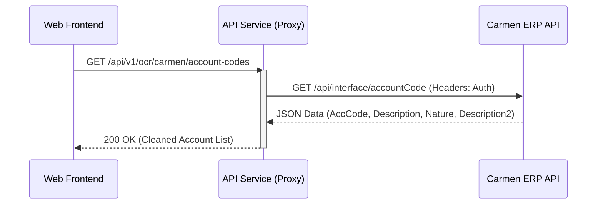
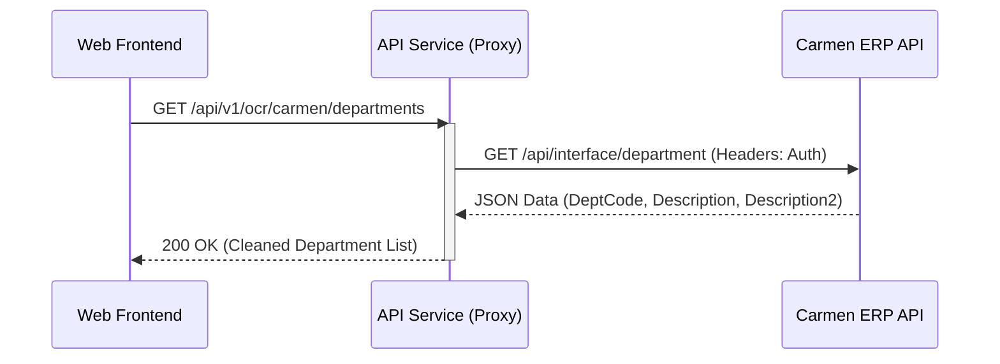
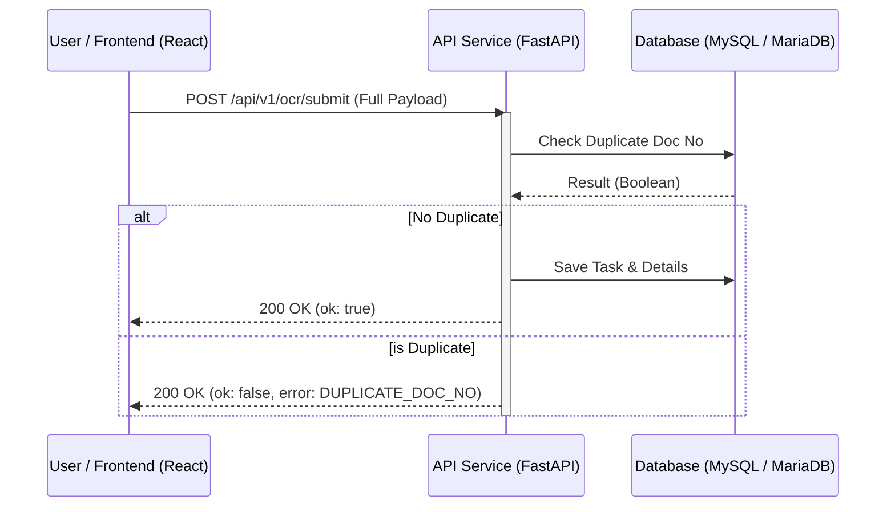

# Requirement Specification: Bank Receipt OCR & Import System Integration

**Project:** Bank Receipt OCR & Import System (API Integration)  
**Date:** 2 April 2026  
**Author:** Intern Team

---

## 0. ประวัติการแก้ไขเอกสาร (Version History)

| Version | Date | Author | Description |
| :--- | :--- | :--- | :--- |
| 1.0 | 01 Apr 2026 | Intern Team | Initial Draft (OCR Integration & LLM Analysis) |
| 1.1 | 01 Apr 2026 | Intern Team | Stateless Refactor & React Frontend Parity Migration |
| 1.2 | 02 Apr 2026 | Intern Team | Carmen API Proxy Integration (Account & Department Master Data) |
| 1.3 | 02 Apr 2026 | Intern Team | Separated Sequence Diagrams by individual API endpoints |
| 1.4 | 02 Apr 2026 | Intern Team | Final Polish: Detailed API Specs, JSON Samples, and Non-Functional Requirements |

---

## 1. บทนำ (Introduction)

เอกสารฉบับนี้จัดทำขึ้นเพื่อกำหนดขอบเขตและความต้องการในการเชื่อมต่อระบบ (Interface Requirements) ระหว่างระบบ **Bank Receipt OCR System** และ **Carmen ERP** ผ่านรูปแบบ RESTful API (JSON Format) โดยมีวัตถุประสงค์เพื่อลดขั้นตอนการทำงานซ้ำซ้อน (Double Entry) และเพิ่มความแม่นยำในการนำเข้าข้อมูลบัญชีรายวันจากรายงานของธนาคาร

## 2. ขอบเขตงาน (Scope of Work)

การเชื่อมต่อข้อมูลประกอบด้วย 4 ส่วนหลัก เรียงตามลำดับความสำคัญของข้อมูลดังนี้:

1.  **Outbound Interface - OCR Extraction**: ประมวลผลไฟล์ภาพหรือ PDF ผ่าน Vision LLM เพื่อดึงข้อมูลออกมาเป็นรูปแบบ JSON (Stateless Extraction)
2.  **Inbound Interface - Master Data Sync**: แบคเอนด์ทำหน้าที่เป็น Proxy ดึงข้อมูลรหัสบัญชีและแผนกจาก Carmen ERP เพื่อใช้ในการตั้งค่า Mapping
3.  **Inbound Interface - Accounting Mapping Logic**: กระบวนการจับคู่รหัสบัญชีอัตโนมัติ พร้อมตรรกะการแยกบุ๊กบัญชีฝั่ง Debit/Credit ตาม `Nature` ของรหัสบัญชี
4.  **Inbound Interface - Data Submission**: ส่งข้อมูลชุดสมบูรณ์ที่ผ่านการตรวจสอบแล้วบันทึกลงในฐานข้อมูล เพื่อรอการสร้างเอกสารในระบบ Carmen ต่อไป

---

## 3. แผนภาพการทำงาน (System Interface Diagrams)

### 3.1 High-Level Architecture

แผนภาพแสดงภาพรวมการเชื่อมต่อระหว่างเบราว์เซอร์ของผู้ใช้, แบคเอนด์ของระบบ และระบบภายนอก (OpenRouter/Carmen):



### 3.2 Sequence Diagram: API 1 - Extract OCR Data (Stateless)

ขั้นตอนการส่งไฟล์เพื่อใช้ Vision LLM ในการอ่านข้อมูล



### 3.3 Sequence Diagram: API 2 - Get Account Codes (Proxy)

การดึงข้อมูลผังบัญชีจาก Carmen ผ่านแบคเอนด์ Proxy



### 3.4 Sequence Diagram: API 3 - Get Departments (Proxy)

การดึงข้อมูลแผนกจาก Carmen ผ่านแบคเอนด์ Proxy



### 3.5 Sequence Diagram: API 4 - Submit Validated Data

ขั้นตอนการบันทึกข้อมูลและตรวจสอบการซ้ำซ้อน



---

## 4. ขั้นตอนการปฏิบัติงานของผู้ใช้งาน (User Operational Workflow)

### 4.1 กรณีการนำเข้าข้อมูลรายวัน (OCR Processing Flow)

1.  **เจ้าหน้าที่**: เลือกธนาคารเป้าหมายและทำการอัปโหลดไฟล์ภาพหรือ PDF
2.  **ระบบ AI**: ประมวลผลและแสดงข้อมูลที่อ่านได้ในรูปแบบที่แก้ไขได้ (Step 3: Verification)
3.  **เจ้าหน้าที่**: ตรวจสอบและแก้ไขความถูกต้องของหัวเอกสาร (Header) และรายการย่อย (Details)
4.  **ระบบ Accounting**: ทำการจับคู่รหัสบัญชีอัตโนมัติและแสดงรายการรายวัน (Step 4: Journal Review)
5.  **เจ้าหน้าที่**: ยืนยันข้อมูลเพื่อบันทึกเข้าสู่ระบบฐานข้อมูลส่วนกลาง

### 4.2 กรณีการจัดการรหัสบัญชี (Account Mapping Workflow)

1.  **เจ้าหน้าที่**: เข้าสู่หน้าจอการตั้งค่า Account Mapping
2.  **ระบบ**: ดึงข้อมูล Master Data ล่าสุดจาก Carmen ERP โดยอัตโนมัติ
3.  **เจ้าหน้าที่**: กำหนดคู่รหัสบัญชี (Account Code) และแผนก (Dept Code) สำหรับยอดเงินแต่ละประเภท (Commission, Tax, Net, etc.)
4.  **ระบบ**: บันทึกการตั้งค่าลงในหน่วยความจำของเบราว์เซอร์ (LocalStorage) เพื่อใช้ในการประมวลผลครั้งถัดไป

---

## 5. รายละเอียดและสเปกของ API (API Specifications)

### 5.1 API 1: Extract OCR Data (Stateless)
**วัตถุประสงค์**: เพื่อประมวลผลรูปภาพและส่งค่า JSON กลับมาให้หน้าจอทันทีโดยไม่บันทึกลงฐานข้อมูล

**Required fields in results**:
- `doc_no`, `doc_date`, `bank_name`, `merchant_name`, `net_amount`, `details` (array)

**Method**: POST  
**Endpoint**: `/api/v1/ocr/extract`

| Parameter | Type | Required | Description |
| :--- | :--- | :--- | :--- |
| `file` | Binary | Yes | ไฟล์ภาพหรืือ PDF (max 10MB) |
| `bank_type` | String | Yes | รหัสธนาคาร (เช่น scb, kbank) |

**JSON Response Specification**:
```json
{
  "status": "success",
  "bank_name": "SCB",
  "doc_no": "12345/2026",
  "details": [
    { "Transaction": "VISA", "PayAmt": "1,000.00", "Total": "970.00" }
  ]
}
```

### 5.2 API 2: Get Account Codes from Carmen
**วัตถุประสงค์**: ดึงข้อมูลผังบัญชี (Chart of Accounts) เพื่อแสดงผลในช่องเลือก Account Code

**Required fields in results**:
- `AccCode`, `Description`, `Description2`, `Nature`

**Method**: GET  
**Endpoint**: `/api/v1/ocr/carmen/account-codes`

| Parameter | Type | Required | Description |
| :--- | :--- | :--- | :--- |
| `N/A` | - | - | Endpoint นี้ไม่รับพารามิเตอร์เพิ่มเติม |

**JSON Response Specification**:
```json
{
  "status": "success",
  "Data": [
    { 
      "AccCode": "113200", 
      "Description": "BANK RECEIVABLE", 
      "Description2": "ลูกหนี้ธนาคาร", 
      "Nature": "DEBIT" 
    }
  ]
}
```

### 5.3 API 3: Get Departments from Carmen
**วัตถุประสงค์**: ดึงข้อมูลรายชื่อแผนกเพื่อแสดงผลในช่องเลือก Dept Code

**Required fields in results**:
- `DeptCode`, `Description`, `Description2`

**Method**: GET  
**Endpoint**: `/api/v1/ocr/carmen/departments`

| Parameter | Type | Required | Description |
| :--- | :--- | :--- | :--- |
| `N/A` | - | - | Endpoint นี้ไม่รับพารามิเตอร์เพิ่มเติม |

**JSON Response Specification**:
```json
{
  "status": "success",
  "Data": [
    { 
      "DeptCode": "100", 
      "Description": "ACCOUNTING", 
      "Description2": "แผนกบัญชี" 
    }
  ]
}
```

### 5.4 API 4: Submit Final Data
**วัตถุประสงค์**: เพื่อบันทึกข้อมูลที่ผ่านการตรวจสอบแล้วลงฐานข้อมูลหลัก

**Method**: POST  
**Endpoint**: `/api/v1/ocr/submit`

**JSON Request Specification (Body)**:
```json
{
  "BankType": "scb",
  "Header": { "DocNo": "12345", "DocDate": "02/04/2026" },
  "Details": [ { "PayAmt": 1000, "TaxAmt": 30 } ],
  "Overwrite": false
}
```

**JSON Response Specification**:
```json
{
  "status": "success",
  "ok": true,
  "message": "บันทึกข้อมูลเรียบร้อยแล้ว",
  "data": {
    "task_id": "T001",
    "submitted_at": "2026-04-02T10:00:00Z"
  }
}
```

---

## 6. ข้อกำหนดอื่นๆ (Non-Functional Requirements)

1.  **Authentication**: การเชื่อมต่อ Carmen API ต้องมีการระบุ Bearer Token ผ่าน Header ของแบคเอนด์เท่านั้น
2.  **Data Mapping**: ระบบต้องทำการเก็บ Cache ของการตั้งค่ารหัสบัญชีไว้ที่เบราว์เซอร์ เพื่อความรวดเร็วในการใช้งานซ้ำ
3.  **Error Logging**: ในกรณีที่เกิดข้อผิดพลาดจากการตรวจสอบข้อมูล (422) แบคเอนด์ต้องส่งรายละเอียดสาเหตุกลับมาเพื่อแสดงผลบน `CustomModal` ชัดเจน
4.  **Performance**: ระบบต้องประมวลผล API Master Data (Proxy) ภายในการตอบสนองไม่เกิน 3 วินาที เพื่อให้หน้าจอ Mapping ไม่เกิดอาการค้าง
